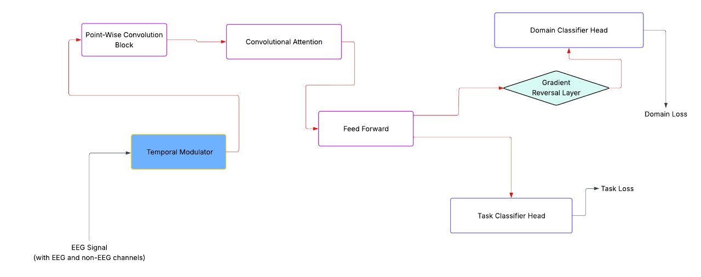

# MTCFormer:



## Overview
We are happy to introduce MTCFormer, our custom-designed architecture tailored for EEG classification tasks. Built with domain adaptation in mind.
`MTCFormerV3.py` implements the MTCFormer model, a deep learning architecture designed for EEG-based classification tasks, especially in scenarios with domain shift (e.g., different subjects or sessions). The model is built for both task prediction and domain adaptation, making it robust for real-world EEG competitions and research.

## Key Features

- **Temporal Modulation:** Learns to modulate EEG signals using auxiliary sensor channels (e.g., accelerometer, gyroscope) to suppress noise and enhance relevant patterns.
- **Pointwise Convolutional Projection:** Projects EEG features to a higher-dimensional space for richer representations.
- **Convolutional Attention Blocks:** Stacked blocks capture local temporal dependencies efficiently, inspired by SSVEPFormer.
- **Dual-Head Output:**
  - **Task Classification Head:** Predicts the main task label (e.g., motor imagery class).
  - **Domain Classification Head:** Uses a gradient reversal layer for adversarial domain adaptation, encouraging domain-invariant features.
- **Highly Configurable:** Depth, kernel sizes, dropout rates, and more are easily adjustable.

## Architecture

1. **TemporalModulator:**
   - Splits input into EEG and sensor channels.
   - Uses sensor data to generate a temporal mask that modulates the EEG signal.
2. **PointWiseConvolutionalBlock:**
   - Projects EEG features to a higher dimension using 1x1 convolutions, normalization, and GELU activation.
3. **ConvolutionalAttention:**
   - Stacked blocks (depth-controlled) with LayerNorm, Conv1D, and FeedForward layers, each with residual connections.
4. **MLP Head:**
   - Flattens and classifies the shared features for the main task.
5. **DomainClassifier:**
   - Adversarial head with gradient reversal for domain adaptation.

## Usage

Instantiate the model with desired parameters:

```python
from model.MTCformerV3 import MTCFormer

model = MTCFormer(
    depth=4,
    kernel_size=7,
    n_times=1200,
    chs_num=7,           # Total channels (EEG + sensors)
    eeg_ch_nums=4,       # EEG channels
    class_num=2,         # Number of task classes
    class_num_domain=9   # Number of domain classes (e.g., subjects)
)

# Forward pass
label_output, domain_output = model(x, domain_lambda=1.0)
```

## File Structure

- `ConvolutionalAttentionBlock`: Local temporal attention via convolution.
- `ConvolutionalAttention`: Stacked attention blocks.
- `TemporalModulator`: Sensor-driven modulation of EEG.
- `PointWiseConvolutionalBlock`: 1x1 conv projection.
- `DomainClassifier`: Adversarial domain head.
- `MTCFormer`: Main model class.

## Reference

- Inspired by SSVEPFormer and DANN (Domain-Adversarial Neural Network).

---

**For more details, see the code comments in `MTCformerV3.py`.**
